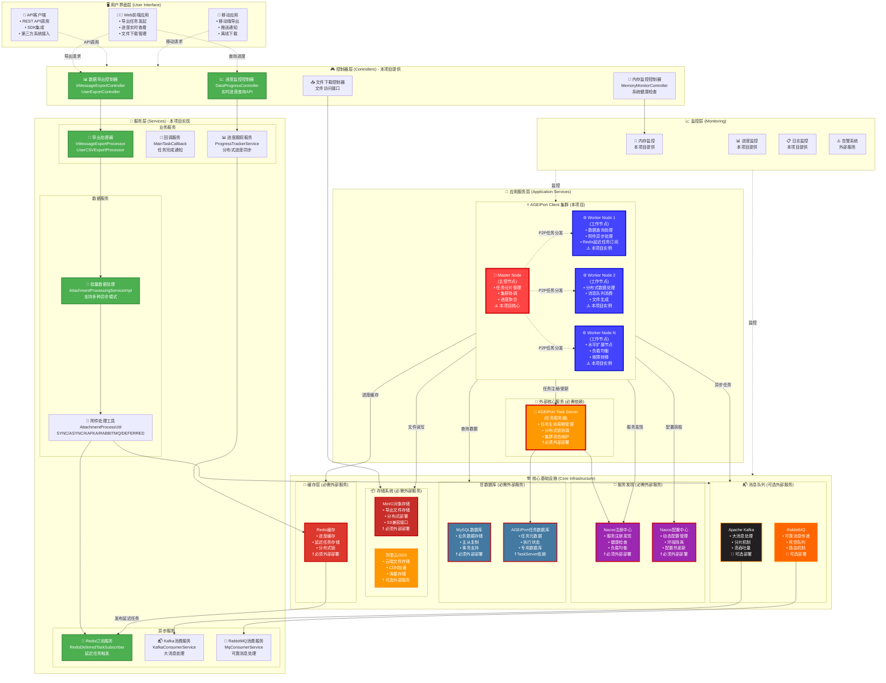
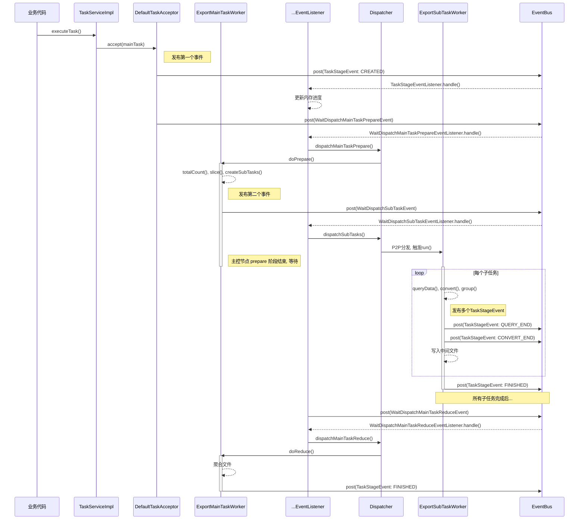

# AGEIPort 分布式导出客户端 - 企业级最佳实践与改造指南

本仓库是一个基于阿里巴巴开源的 [AGEIPort](https://github.com/alibaba/AGEIPort) 分布式导入导出框架构建的**企业级最佳实践模板**。它演示了如何将 AGEIPort 深度集成到现代微服务技术栈（Spring Boot/Cloud）中，并提供了一套**高内聚、低耦合、易扩展**的解决方案。

**本项目旨在解决大数据量（百万级、千万级）导出场景下的性能瓶颈，并优雅地处理导出完成后需要进行的、耗时更长的异步业务（如文件打包、数据分析、调用外部API等）。**

开发者只需**聚焦于纯粹的业务逻辑**，通过简单的“填空式”开发，即可快速为项目赋予分布式、高性能、可观测、可扩展的文件导出与后处理能力。

项目还正在持续更新和扩展, 可以定期去拉取最新的代码

## 目录

- [**1. 架构概览：理解你的位置**](#1-架构概览理解你的位置)
- [**2. 核心设计与特性**](#2-核心设计与特性)
- [**3. 环境准备：搭建完整的 AGEIPort 系统**](#3-环境准备搭建完整的-ageiport-系统)
- [**4. 快速启动：先让示例跑起来**](#4-快速启动先让示例跑起来)
- [**5. 改造为己用：集成你的导出业务（核心）**](#5-改造为己用集成你的导出业务核心)
- [**6. 高级定制：玩转后处理与多 Sheet**](#6-高级定制玩转后处理与多-sheet)
- [**7. 项目结构解析**](#7-项目结构解析)

---

## 1. 架构概览：理解你的位置

在开始之前，最重要的一点是：**本项目 (`ageiport-client`) 仅仅是整个分布式导出系统中的一个“计算节点” (Worker Node)。** 它无法独立运行，必须与其他核心服务协同工作。

一个完整的 AGEIPort 生产环境通常由以下几个部分组成：




该框架是基于事件驱动的架构流程, 要想理解这个分布式任务导出框架,就需要理解它的事件流, 下面是一个基本的事件驱动流程:




**你的工作范围**：主要在 `ageiport-client` 中实现**业务逻辑**，特别是 `ExportProcessor`，并确保其他基础设施服务（Task Server, Nacos/Eureka, MySQL, MinIO, Redis, RabbitMQ/Kafka等）已正确部署和配置。

---

## 2. 核心设计与特性

理解以下设计将帮助你更好地使用和扩展此项目。

-   **🔌 动态分层配置**：实现了 `API 实时参数 > Nacos/本地配置 > 代码默认值` 的优雅覆盖机制，让配置管理既灵活又可预测。
-   **🧩 可插拔文件存储**：通过自定义 AGEIPort 的 `FileStoreFactory` SPI，完整实现了 MinIO 存储插件，并可通过 `application.yml` 中的 `ageiport.file-store.type` 在 MinIO 和阿里云 OSS 之间轻松切换。
-   **🔄 解耦的异步任务回调**：采用**代理模式 (`MainTaskCallbackProxy`)** 巧妙地解决了 AGEIPort SPI 机制与 Spring Bean 依赖注入的生命周期冲突问题，可以自由地在任务回调中注入并使用任何 Spring Bean 来处理复杂业务（如更新数据库、发送 WebSocket 通知）。

- **📡 分布式事件广播**：提供了基于 **HTTP** 和 **Redis Pub/Sub** 的两种分布式广播策略，集群中的每个节点都能收到通知并执行本地的延迟任务。

-   **🚀 灵活的异步后处理框架**: 支持 `SYNC` (同步), `ASYNC` (异步), `DEFERRED` (延迟执行), `RABBITMQ`, `KAFKA`, `NONE` (不处理) 多种模式，通过 `application.yml` 或 API 参数动态切换。
-   **🔭 分布式进度监控与可观测性**: 实现了对 **AGEIPort核心导出** 和 **业务异步后处理** 两个独立流程的并行监控。
-   **🖥️ 系统健康监控**: 内置内存监控服务和 API (`/api/monitor/memory`)，便于实时了解应用健康状况，排查性能问题。

---

## 3. 环境准备：搭建完整的 AGEIPort 系统

在运行本项目前，请确保你已部署并运行了以下**所有**外部依赖。

| 组件                     | 用途                     | 部署指南                                                     |
| ------------------------ | ------------------------ | ------------------------------------------------------------ |
| **Java & Maven**         | 编译和运行本项目         | Java 1.8+, Maven 3.5+                                        |
| **MySQL 数据库**         | 存储业务数据和任务元数据 | 创建两个数据库，一个用于你的业务（本项目提供了 `ir_message.sql` 作为示例），另一个专用于 `ageiport-task-server`。建议 8.0+ |
| **Nacos / Eureka**       | 服务注册与发现、配置中心 | [Nacos 快速开始](https://nacos.io/zh-cn/docs/quick-start.html) 建议 2.2.3 |
| **Redis**                | **必须**: 分布式进度跟踪 | [Redis 快速开始](https://redis.io/docs/getting-started/) 建议6.0+ |
| **MinIO 或 阿里云 OSS**  | 共享文件存储             | [MinIO 快速开始](https://min.io/docs/minio/linux/index.html) 或准备好 OSS Bucket 和 AccessKey。 |
| **RabbitMQ / Kafka**     | 消息队列 (可选)          | 用于 `RABBITMQ` 或 `KAFKA` 后处理模式。                      |
| **AGEIPort Task Server** | **核心**: 任务调度中心   | 1. 克隆官方仓库: `git clone https://github.com/alibaba/AGEIPort.git`<br>2. 进入 `ageiport-task-server` 模块<br>3. 修改其 `application.properties`，配置好 **任务数据库**  的地址<br>4. 编译并启动该服务。 |

---

## 4. 快速启动：先让示例跑起来

在所有环境准备就绪后，通过以下步骤运行本项目的 `ir_message` 导出示例，以验证整体环境连通性。

1. **克隆本项目**

   ```bash
   git clone https://github.com/jackasher36/distributed-export-client.git
   cd distributed-export-client
   ```

2. **配置 `application-dev.yml`**
   打开 `src/main/resources/application-dev.yml`，修改以下**所有**标记为你自己的环境信息：

   -   `spring.datasource`: 连接到你的**业务数据库**。
   -   `spring.redis`: 你的 Redis 地址。
   -   `spring.cloud.nacos.server-addr` 或 `eureka.client.service-url`: 你的服务发现中心地址。
   -   `spring.rabbitmq` / `spring.kafka`: 你的消息队列地址（如果使用）。
   -   `ageiport.file-store`: 配置你的 MinIO 或 OSS 信息。
   -   `ageiport.taskServerClientOptions.endpoint`: 你的 `ageiport-task-server` 服务的地址。

3. **准备业务测试数据 (重要)**
   大数据量是体现分布式导出价值的关键。

   -   **执行脚本**: 在你的**业务数据库**中执行 `src/main/resources/ir_message.sql` 脚本，创建 `ir_message` 表。
   -   **生成数据**: 强烈建议使用数据库工具（如 DataGrip, Navicat）或存储过程，向 `ir_message` 表中插入**百万级别**的模拟数据。

4. **启动应用**
   运行 `AgeiPortApplication.java` 的 `main` 方法，或使用 Maven 启动：

   ```bash
   mvn spring-boot:run -Dspring-boot.run.profiles=dev
   ```

   **集群启动**：要体验分布式效果，请在**不同机器**或**不同端口**上启动多个 `ageiport-client` 实例。注意修改 `server.port` 以避免端口冲突。

5. **触发导出任务**
   使用 `curl` 或 API 工具向 `/ir-message/export` 发送一个 `POST` 请求:

   ```bash
   curl -X POST http://localhost:8775/ir-message/export \
   -H "Content-Type: application/json" \
   -d '{
         "fileName": "example",
         "exportParams": {
           "totalCount": 500000,
           "sheetRowNumber": 100000,
           "pageRowNumber": 10000,
           "processAttachments": true,
           "batchDataProcessMode": "ASYNC" 
         }
       }'
   ```

   -   `batchDataProcessMode`: 可以尝试 `ASYNC`, `KAFKA`, `DEFERRED` 等不同值来体验不同的后处理模式。

6. **监控进度**
   在收到包含 `mainTaskId` 的响应后，立即开始轮询进度接口：

   ```bash
   curl http://localhost:8775/export/full-progress/{your_main_task_id}
   ```

   观察返回的 JSON，你将看到 `dataExportProgress` 和 `attachmentProcessingProgress` 两个部分的进度在独立更新。

---

## 5. 改造为己用：集成你的导出业务（核心）

假设你需要为一个 `product_info` (产品信息) 表创建一个新的导出功能。

### 第一步：定义你的“三件套”模型

在 `com.jackasher.ageiport.model` 包下创建新包 `product`，并定义三个核心类：`ProductQuery.java`, `ProductData.java`, `ProductView.java`。

### 第二步：实现数据访问层 (Mapper)

在 `com.jackasher.ageiport.mapper` 包下创建 `ProductMapper.java` 接口，继承 `BaseMapper<Product>`。

### 第三步：创建核心业务处理器 (Processor)

这是你实现**核心业务逻辑**的地方。在 `com.jackasher.ageiport.processer` 包下创建 `ProductExportProcessor.java`。

> **注意**：`Processor` 不是 Spring Bean，不能 `@Resource` 注入。请使用项目提供的 `SpringContextUtil.getBean(...)` 来获取 Mapper 或其他 Service。

**模板参考 `IrMessageExportProcessor.java`，你需要实现的关键方法：**

-   `totalCount()`: 计算总数据量，在主节点执行。
-   `queryData()`: 分页查询数据，在子任务节点并行执行。
-   `convert()`: 模型转换，**在这里调用 `AttachmentProcessUtil.processAttachments` 来发起你的异步后处理任务**。

### 第四步：注册你的处理器 (SPI)

打开 `resources/META-INF/ageiport/com.alibaba.ageiport.processor.core.Processor` 文件，**添加新的一行**：

```properties
# 格式：注解中的code = 你的处理器的完整类路径
ProductExportProcessor=com.jackasher.ageiport.processer.ProductExportProcessor
```

### 第五步：暴露 API 接口 (Controller)

在 `com.jackasher.ageiport.controller.database` 包下创建 `ProductExportController.java`，参照 `IrMessageExportController` 实现即可。

---

## 6. 高级定制：后处理与多 Sheet

-   **多 Sheet 导出**: 参考 `IrMessageExportProcessor` 中对 `getHeaders` 和 `group` 方法的重写。通过为表头设置不同的 `groupIndex`，可以动态地将数据分配到不同的 Sheet 中。
-   **任务回调**: 修改 `com.jackasher.ageiport.callback.MainTaskCallback.java` 中的方法，可以实现任务成功/失败时发送邮件、钉钉通知、更新业务数据库等逻辑。
-   **自定义数据处理业务**:`BatchDataProcessingServiceImplDemo`已经实现同步异步功能, 只需在`processData`编写你自己的数据处理模块,如果还想要更多的自定义业务处理模式参考:
   1.  在 `AttachmentProcessMode` 枚举中添加你的新模式。
   2.  在 `BatchDataProcessingService` 接口和实现中添加你的新业务方法（参考 `AttachmentProcessingServiceImpl`）。
   3.  在 `AttachmentProcessUtil` 中注册你的新模式和对应的处理方法。
   4.  最后，在你的 `Processor#convert` 方法中调用 `AttachmentProcessUtil.processAttachments` 即可触发。

## 7. 项目结构解析

```
distributed-export-client
└── src/main
    ├── java/com/jackasher/ageiport
    │   ├── callback/          # ✅ 任务完成/失败的全局回调 (可修改)
    │   ├── config/            # 平台层配置 (一般无需修改)
    │   ├── controller/        # ✅ API接口 (添加你的Controller)
    │   ├── listener/          # ✅ 分布式事件监听器 (可添加新监听器)
    │   ├── mapper/            # ✅ MyBatis Mapper接口 (添加你的Mapper)
    │   ├── model/             # ✅ 数据模型 (添加你的Query, Data, View, DTO)
    │   ├── mq/                # ✅ MQ生产者和消费者 (MQ模式核心)
    │   ├── processer/         # ✅ 核心处理器 (添加你的Processor)
    │   ├── publisher/         # ✅ 延迟任务触发策略 (可添加新策略)
    │   ├── service/           # ✅ 业务服务 (添加你的业务逻辑)
    │   └── utils/             # 业务/平台工具类
    └── resources
        ├── mapper/            # ✅ MyBatis XML文件
        └── META-INF/ageiport/ # ✅ SPI配置文件 (在这里注册你的Processor等)
```