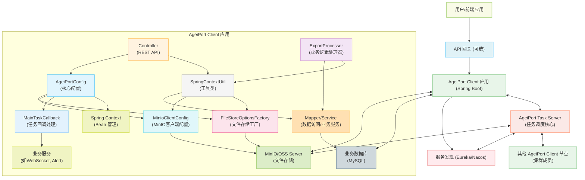

# AGEIPort 分布式导出客户端 - 最佳实践与改造指南

本仓库是一个基于阿里巴巴开源的 [AGEIPort](https://github.com/alibaba/AGEIPort) 分布式导入导出框架构建的**企业级最佳实践模板**。它演示了如何将 AGEIPort 深度集成到现代微服务技术栈（Spring Boot/Cloud）中，并提供了一套**高内聚、低耦合、易扩展**的解决方案。

**我的目标**：让你只需**关注业务逻辑**，通过简单的“填空式”开发，即可快速为你的项目赋予分布式、高性能、可观测的文件导出能力。

## 目录

- [**1. 架构概览：理解你的位置**](#1-架构概览理解你的位置)
- [**2. 核心设计与特性**](#2-核心设计与特性)
- [**3. 环境准备：搭建完整的 AGEIPort 系统**](#3-环境准备搭建完整的-ageiport-系统)
- [**4. 快速启动：先让示例跑起来**](#4-快速启动先让示例跑起来)
- [**5. 改造为己用：集成你的导出业务（核心）**](#5-改造为己用集成你的导出业务核心)
- [**6. 高级定制**](#6-高级定制)
- [**7. 项目结构解析**](#7-项目结构解析)

---

## 1. 架构概览：理解你的位置

在开始之前，最重要的一点是：**本项目 (`ageiport-client`) 仅仅是整个分布式导出系统中的一个“计算节点” (Worker Node)。** 它无法独立运行，必须与其他核心服务协同工作。

一个完整的 AGEIPort 生产环境通常由以下几个部分组成：




**你的工作范围**：主要在 `ageiport-client` 中实现**业务逻辑**，并确保其他基础设施服务（Task Server, Nacos, MySQL, MinIO等）已正确部署和配置。

---

## 2. 核心设计与特性

理解以下设计将帮助你更好地使用和扩展此项目。

-   **🔌 动态分层配置**：实现了 `API 实时参数 > Nacos/本地配置 > 代码默认值` 的优雅覆盖机制，确保最大的灵活性。
-   **🧩 可插拔文件存储**：通过自定义 SPI，完整实现了 MinIO 存储插件，并可通过配置在 MinIO 和 OSS 之间轻松切换。
-   **🔄 解耦的异步任务回调**：采用**代理模式**巧妙地解决了 AGEIPort SPI 机制与 Spring Bean 依赖注入的生命周期冲突问题，让你可以自由地在任务回调中处理复杂业务。
-   **📦 清晰的业务逻辑分离**：将数据处理等复杂业务逻辑剥离到独立的 `Service` 中，保持 `Processor` 的核心职责纯粹。`processAndPackageAttachments`中可以自定义你的数据处理业务

---

## 3. 环境准备：搭建完整的 AGEIPort 系统

在运行本项目前，请确保你已部署并运行了以下**所有**外部依赖。

| 组件                     | 用途                     | 部署指南                                                     |
| ------------------------ | ------------------------ | ------------------------------------------------------------ |
| **Java & Maven**         | 编译和运行本项目         | Java 1.8+, Maven 3.5+, nacos 2.2.3, mysql 8+,                |
| **MySQL 数据库**         | 存储业务数据和任务元数据 | 创建两个数据库，一个用于你的业务（如你需要导出的数据,在Resource下已经有了ir_message.sql可以做测试），另一个专用于 `ageiport-task-server`。 |
| **Nacos Server**         | 服务注册与发现、配置中心 | [Nacos 快速开始](https://nacos.io/zh-cn/docs/quick-start.html) |
| **MinIO 或 阿里云 OSS**  | 共享文件存储             | [MinIO 快速开始](https://min.io/docs/minio/linux/index.html) 或准备好 OSS Bucket 和 AccessKey。 |
| **AGEIPort Task Server** | **核心：任务调度中心**   | 1. 克隆官方仓库: `git clone https://github.com/alibaba/AGEIPort.git`<br>2. 进入 `ageiport-task-server` 模块<br>3. 修改其 `application.properties`，配置好 **任务数据库** 的地址<br>4. 编译并启动该服务。 |

---

## 4. 快速启动：先让示例跑起来

在所有环境准备就绪后，通过以下步骤运行本项目的 `ir_message` 导出示例，以验证整体环境连通性。

1. **克隆本项目**

   ```bash
   git clone https://github.com/jackasher36/distributed-export-client.git
   ```

2. **配置 `application-dev.yml`**
   打开 `src/main/resources/application-dev.yml`，修改以下**所有**标记为你自己的环境信息：

    -   `spring.datasource`: 连接到你的**业务数据库**。
    -   `spring.cloud.nacos.server-addr`: 你的 Nacos Server 地址。
    -   `ageiport.file-store.oss`: 你的阿里云 OSS 配置 (如果 `type` 为 `oss`)。
    -   `ageiport.file-store.minio`: 你的 MinIO 配置 (如果 `type` 为 `minio`)。
    -   `ageiport.taskServerClientOptions.endpoint`: 你的 `ageiport-task-server` 服务的地址。

3.  **准备业务测试数据 (重要)**
    为了充分测试分布式导出的性能和效果，你需要一个包含大量数据的业务表。

    a. **创建表结构**:

    - 找到项目中的 src/main/resources/ir_message.sql 文件。
    - 在你的**业务数据库**中执行此 SQL 脚本，它会创建一个名为 ir_message 的表。

    b. **生成百万级模拟数据**:

    - 大数据量是体现分布式导出价值的关键。推荐使用数据库客户端工具来快速生成模拟数据。

4. **启动应用**
   运行 `AgeiPortApplication.java` 的 `main` 方法，或使用 Maven 启动：

   ```bash
   mvn spring-boot:run -Dspring-boot.run.profiles=dev
   ```

5. **触发导出任务**
   使用 `curl` 或 Postman 向 `http://localhost:8775/ir-message/export` 发送一个 `POST` 请求:

   ```bash
   curl -X POST http://localhost:8775/ir-message/export \
   -H "Content-Type: application/json" \
   -d '{
         "fileName": "example",
         "exportParams": {
           "totalCount": 500,
           "sheetRowNumber": 100,
           "pageRowNumber": 50
         }
       }'
   ```

   如果一切正常，你将收到一个包含 `mainTaskId` 的 JSON 响应，表示任务已成功提交。稍后，文件将出现在你配置的 MinIO 或 OSS 中。

   **注意! :**如果要搭建集群,必须使用不同的机器,因为内部端口会冲突,导致无法派发任务

---

## 5. 改造为己用：集成你的导出业务（核心）

假设你需要为一个 `product_info` (产品信息) 表创建一个新的导出功能。

### 第一步：定义你的“三件套”模型

在 `com.jackasher.ageiport.model` 包下创建新包 `product`，并定义三个核心类：

1. **`ProductQuery.java`** (查询参数)

   ```java
   // com/jackasher/ageiport/model/product/ProductQuery.java
   @Data
   public class ProductQuery {
       private String productName;
       private String category;
       // 关键！必须包含它，以支持API级别的配置覆盖
       private ExportParams exportParams = new ExportParams();
   }
   ```

2. **`ProductData.java`** (领域模型, 对应 `product_info` 表)

   ```java
   // com/jackasher/ageiport/model/product/ProductData.java
   @Data
   @TableName("product_info") // MyBatis-Plus注解
   public class ProductData {
       private Long id;
       private String productName;
       // ... 其他与表字段对应的属性
   }
   ```

3. **`ProductView.java`** (视图模型, 用于Excel展示)

   ```java
   // com/jackasher/ageiport/model/product/ProductView.java
   @Data
   public class ProductView {
       @ViewField(headerName = "产品ID")
       private Long id;
       
       @ViewField(headerName = "产品名称", columnWidth = 50)
       private String productName;
       // ... 其他你希望在Excel中展示的列
   }
   ```

### 第二步：实现数据访问层 (Mapper)

1. 在 `com.jackasher.ageiport.mapper` 包下创建 `ProductMapper.java` 接口。

   ```java
   @Mapper
   public interface ProductMapper extends BaseMapper<ProductData> {
   }
   ```

2. 确保 `AgeiPortApplication.java` 中的 `@MapperScan("com.jackasher.ageiport.mapper")` 能扫描到你的新 Mapper。

### 第三步：创建核心业务处理器 (Processor)

这是你实现**核心业务逻辑**的地方。

1. 在 `com.jackasher.ageiport.processer` 包下创建 `ProductExportProcessor.java`。

2. **参照以下模板填写**，实现 `ExportProcessor` 接口。

   ```java
   // com/jackasher/ageiport/processer/ProductExportProcessor.java
   @ExportSpecification(
       code = "ProductExportProcessor", // 全局唯一的任务编码
       name = "产品信息导出",
       executeType = ExecuteType.CLUSTER // 推荐使用集群模式
   )
   public class ProductExportProcessor implements ExportProcessor<ProductQuery, ProductData, ProductView> {
   
       // 注意：Processor不是Spring Bean，不能@Resource注入，需要通过工具类获取
       private ProductMapper getMapper() {
           return SpringContextUtil.getBean(ProductMapper.class);
       }
       
       // 1. 计算总数 (在主节点执行)
       @Override
       public Integer totalCount(BizUser bizUser, ProductQuery query) {
           LambdaQueryWrapper<ProductData> wrapper = buildQueryWrapper(query);
           long count = getMapper().selectCount(wrapper);
           // 使用工具类获取最终生效的最大导出数
           int maxTotal = IrMessageUtils.getResolvedParams(query).getTotalCount();
           return Math.min((int) count, maxTotal);
       }
   
       // 2. 分页查询数据 (在子任务节点并行执行)
       @Override
       public List<ProductData> queryData(BizUser user, ProductQuery query, BizExportPage page) {
           LambdaQueryWrapper<ProductData> wrapper = buildQueryWrapper(query);
           Page<ProductData> mybatisPage = new Page<>( (page.getOffset() / page.getSize()) + 1, page.getSize() );
           IPage<ProductData> resultPage = getMapper().selectPage(mybatisPage, wrapper);
           return resultPage.getRecords();
       }
   
       // 3. 将数据库模型转换为视图模型 (在子任务节点并行执行)
       @Override
       public List<ProductView> convert(BizUser user, ProductQuery query, List<ProductData> data) {
           // 在这里进行数据格式化、字典翻译等操作
           return data.stream().map(d -> {
               ProductView view = new ProductView();
               BeanUtils.copyProperties(d, view);
               // 示例：view.setStatusText(convertStatus(d.getStatus()));
               return view;
           }).collect(Collectors.toList());
       }
       
       // 辅助方法：构建查询条件
       private LambdaQueryWrapper<ProductData> buildQueryWrapper(ProductQuery query) {
           LambdaQueryWrapper<ProductData> wrapper = new LambdaQueryWrapper<>();
           wrapper.like(StringUtils.isNotEmpty(query.getProductName()), ProductData::getProductName, query.getProductName());
           wrapper.orderByDesc(ProductData::getCreateTime);
           return wrapper;
       }
   }
   ```

### 第四步：注册你的处理器 (SPI)

AGEIPort 通过 `META-INF/ageiport` 目录下的文件来发现和加载扩展。

打开 `resources/META-INF/ageiport/com.alibaba.ageiport.processor.core.Processor` 文件，**添加新的一行**：

```properties
# 格式：注解中的code = 你的处理器的完整类路径
ProductExportProcessor=com.jackasher.ageiport.processer.ProductExportProcessor
```

### 第五步：暴露 API 接口 (Controller)

在 `com.jackasher.ageiport.controller` 包下创建 `ProductExportController.java`。

```java
@RestController
@RequestMapping("/product")
public class ProductExportController {

    @Resource
    private AgeiPort ageiport;

    @PostMapping("/export")
    public TaskExecuteResult exportProducts(@RequestBody ProductQuery query) {
        TaskExecuteParam request = new TaskExecuteParam();
        // 关键：这里的 Code 必须与你在 Processor 中定义的完全一致
        request.setTaskSpecificationCode("ProductExportProcessor");
        request.setBizQuery(JSON.toJSONString(query));

        // 推荐：设置用户信息，便于追踪和回调
        // request.setBizUserId(SecurityUtils.getCurrentUserId()); 

        return ageiport.getTaskService().executeTask(request);
    }
}
```

**完成！** 重启你的 `ageiport-client` 应用，现在你可以调用 `/product/export` 接口来触发新的导出任务了。

## 6. 高级定制

-   **多 Sheet 导出**: 参考 `IrMessageExportProcessor` 中对 `getHeaders` 和 `group` 方法的重写。
-   **任务回调**: 修改 `com.jackasher.ageiport.callback.MainTaskCallback.java` 中的方法，可以实现任务成功/失败时发送邮件、钉钉通知、更新业务数据库等逻辑。
-   **用户体系集成**: 在 Controller 中，从你的安全框架（如 Spring Security）获取当前用户，并设置到 `TaskExecuteParam` 的 `bizUserId` 等字段中。
-   **自定义复杂数据处理流程:** 在`Service`中,我们可以将`processAndPackageAttachments`更改为你自己的业务逻辑,该方法接受每批次获取到的导出数据

## 7. 项目结构解析

```
distributed-export-client
└── src/main
    ├── java/com/jackasher/ageiport
    │   ├── callback/          # ✅ 任务回调逻辑 (可修改)
    │   ├── config/            # 平台层配置 (一般无需修改)
    │   ├── controller/        # ✅ API接口 (添加你的Controller)
    │   ├── mapper/            # ✅ MyBatis Mapper接口 (添加你的Mapper)
    │   ├── model/             # ✅ 数据模型 (添加你的Query, Data, View)
    │   ├── processer/         # ✅ 核心处理器 (添加你的Processor)
    │   └── service/           # ✅ 业务服务 (添加你的业务逻辑)
    └── resources
        ├── mapper/            # ✅ MyBatis XML文件
        └── META-INF/ageiport/ # ✅ SPI配置文件 (在这里注册你的Processor)
```